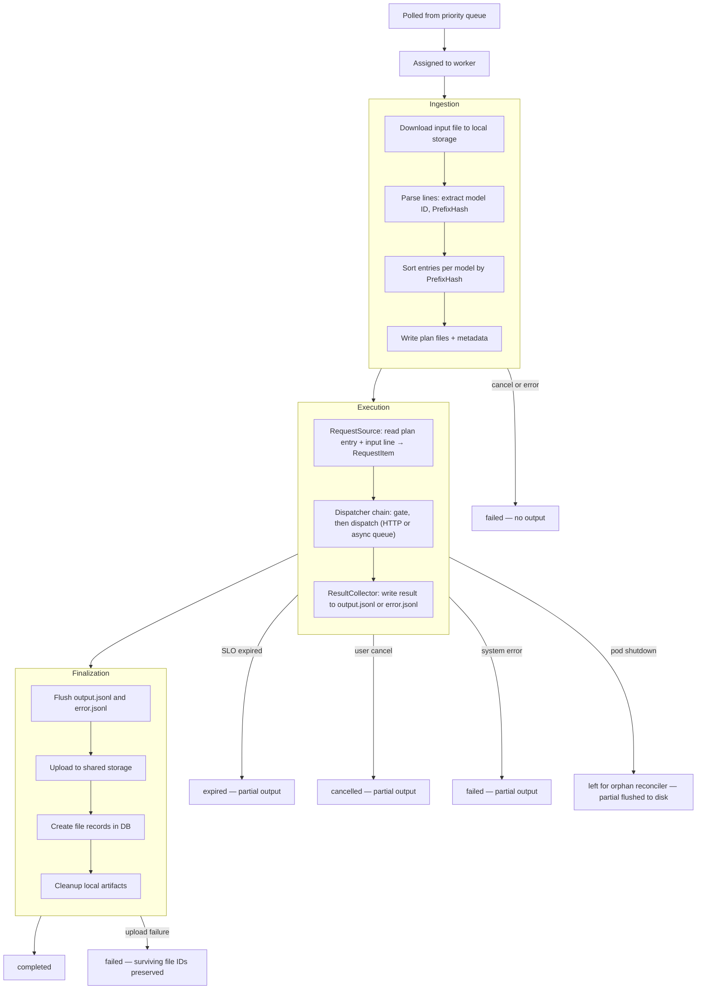
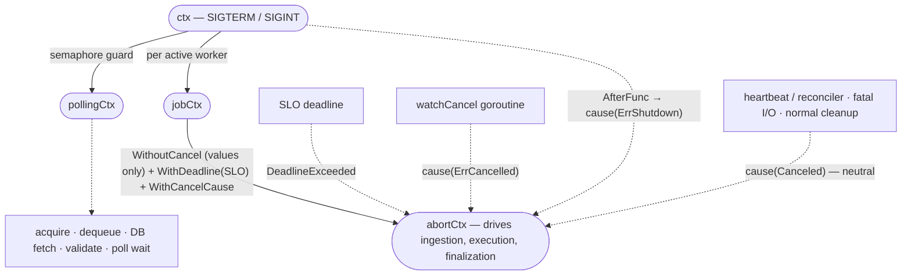
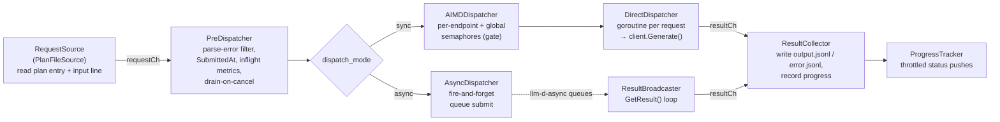
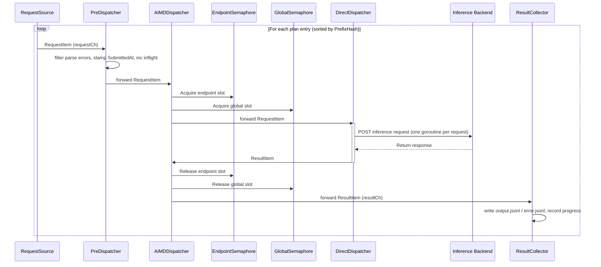

# Batch Processor Design

-   **Revision**: 9
-   **Last Updated**: 2026-07-29

-------------------------------------------------------------------

### Overview

#### Background

The batch processor is designed to execute large batch inference jobs (up to 50,000 requests per job, up to 200MB input file) while
maintaining bounded memory usage and predictable scheduling behavior.

The current design focuses on:
-   Preventing memory explosion when processing large input files
-   Enabling model-aware execution ordering
-   Ensuring fairness across models
-   Remaining deployment-agnostic (independent of GPU topology or
    backend layout)
-   Maintaining OpenAI-compatible request/response schema parity

This document describes the ingestion → execution → finalization processing architecture and scheduling model.

-------------------------------------------------------------------

### Design Goals

#### 1. Bounded Memory Usage

-   Maximum 50,000 requests per batch
-   Maximum 200MB input file
-   Memory usage must be bounded regardless of request count
-   Request bodies are never accumulated in memory

-------------------------------------------------------------------

#### 2. Model-Aware Scheduling

-   Requests targeting the same model should be grouped
-   Locality should be preserved where possible
        - Keep same model request execution (MVP)
        - Keep same endpoint group execution (TBD)
        - Keep the same execution context (TBD)
-   Avoid unnecessary churn in backend execution context

Locality is defined as executing similar work back-to-back to reuse warm state (caches, connections, scheduling context).

-------------------------------------------------------------------

#### 3. Fairness Across Models

-   No model should starve other models
-   Hot models must not monopolize execution capacity
-   Scheduling policy must prevent starvation

-------------------------------------------------------------------

#### 4. Clear Module Boundaries

Separate responsibilities into independent modules:

-   Polling
-   Validation
-   Ingestion
-   Plan storage
-   Scheduling
-   Execution
-   Result writing

Each module must be testable independently.

-------------------------------------------------------------------

#### 5. Deployment-Agnostic

-   The processor treats the inference backend as an opaque execution layer and does not assume any specific model-to-device mapping or GPU layout.

-------------------------------------------------------------------

#### 6. OpenAI Schema Parity

-   Request JSON schema parity: required
-   Response JSON schema parity: required
-   Error schema parity: required
-   Allowed API methods must match OpenAI parity
-   Functional parity: not guaranteed

Unsupported features must return OpenAI-compatible error responses.

-------------------------------------------------------------------

**Non-Goals (MVP)**

-   GPU placement or resource allocation strategies
-   Cross-job fairness (time-sliced or budget-based scheduling across multiple jobs) is not provided. Jobs are processed in a run-to-completion manner once assigned to a worker. Model-level fairness is achieved via bounded concurrent dispatch with global and per-model concurrency limits using semaphores.
-   Cost-based (token-length-aware) scheduling - cost(expected total tokens: input + max output tokens, expected execution time, GPU compute usage, memory footprint, average latency history) is not considered.
-   Advanced adaptive scheduling (e.g., latency-aware scheduling, token-cost-aware scheduling, dynamic budget tuning) is not provided. Basic backpressure-based throttling is provided via per-endpoint AIMD concurrency control (429/5xx signals).
-   Assumption (MVP): the priority queue provides exclusive dequeue semantics. Lease/heartbeat-based recovery for worker death is out of scope for MVP.

-------------------------------------------------------------------

#### Startup Recovery

When the processor starts, `recoverStaleJobs` scans the local work directory for job directories left behind by a previous container crash (OOM, panic, node eviction). For each stale directory it finds the corresponding DB record and takes action based on the job's status:

-   `in_progress` (no output on disk): re-enqueue the job so another worker can process it from scratch. If SLO expired, upload any surviving partial files (e.g. error.jsonl from ingestion) and mark as `expired`. If re-enqueue fails, mark as `failed`.
-   `in_progress` (output exists on disk): upload partial results and mark as `failed` (inference cost is significant — preserve completed work rather than retry from scratch).
-   `finalizing`: attempt to complete finalization (upload output). If upload fails, mark as `failed` with surviving file IDs preserved.
-   `cancelling`: upload partial results and transition to `cancelled`.
-   `validating`: re-enqueue (ingestion had not started). If SLO expired, mark as `expired` (no output files exist at this stage). If re-enqueue fails, mark as `failed`.
-   Other terminal states: clean up the directory only.

After recovery, stale directories are removed. Resume-from-checkpoint is not supported — recovered jobs are retried from scratch.

The `batch_startup_recovery_total{status,action}` metric tracks recovery outcomes for operational visibility.

The `resumable` database marker added for [#645](https://github.com/llm-d/llm-d-batch-gateway/issues/645) is currently a reader-side guard only; no production path sets it to `true`. Before a later writer enables resumable rows, this guard-aware version must be deployed to every API server, Processor, and batch-gc instance. Rollback to a marker-unaware version is unsupported while any resumable row remains non-terminal. The initial resumable-recovery implementation must run with one Processor replica, `numWorkers=1`, one Async model queue, PostgreSQL, and batch-gc enabled. Direct Processor scaling and autoscaling are unsupported until multi-replica ownership and takeover are implemented.

--------------------------------------------------------------------
### High-Level Architecture
#### Processor and Worker
> Processor (Manager): Actively monitors the priority queue and tracks the availability of the worker pool.

> Job Dispatching: When a Worker becomes idle, the Processor claims the job and assigns it to that worker.

> Isolation: Each Worker independently handles the entire lifecycle of its assigned job, ensuring failure isolation.

#### 1. Job Lifecycle



**Ingestion**

1.  Download the input file from shared storage to local disk (`input.jsonl`)
2.  Parse each line minimally to extract the target model ID and PrefixHash
3.  Accumulate request location (offset, length) and PrefixHash in memory
4.  Sort entries per model by PrefixHash for cache-friendly dispatch ordering
5.  Write sorted plan files (one per model) and a metadata file (model map + total line count)

**Execution**

Execution runs as a **channel-based pipeline** of concurrent actors, orchestrated by a `JobExecutor` (see [Execution](#execution) below): a single request source feeds a composable dispatcher chain that emits results to a collector.

1.  A single `RequestSource` reads plan entries (in `PrefixHash`-sorted order), reads each input line at the recorded offset, parses it, and emits a `RequestItem` onto the request channel
2.  A dispatcher chain gates and dispatches each request — either directly over HTTP (**sync** mode) or by enqueuing to the llm-d-async request queue (**async** mode) — and emits a `ResultItem` onto the result channel
3.  A `ResultCollector` writes each response to `output.jsonl` (success) or `error.jsonl` (inference error) and updates progress counters
4.  If interrupted (SLO expiry, cancel, system error): the dispatcher chain drains undispatched entries as error results with the appropriate error code, the collector flushes writers, and the executor returns partial counts

**Finalization**

1.  Flush buffered `output.jsonl` and `error.jsonl` to disk
2.  Upload non-empty files to shared storage (with exponential backoff retry)
3.  Create file records in DB; set `output_file_id` / `error_file_id` on the job
4.  Transition status to `completed`; cleanup local artifacts
-------------------------------------------------------------------

#### 2. State Transitions

Allowed transitions:
-   `validating` (initial state: set when a batch job is created)
-   `validating → in_progress` (after ingestion succeeds — preProcessJob completes)
-   `in_progress → finalizing` (after all plans drained)
-   `finalizing → completed` (after uploading output and error files)
-   `* → failed` (job is unable to process)
-   `validating → expired` (SLO already exceeded before execution starts — skipped at dequeue)
-   `in_progress → expired` (SLO exceeded during execution — partial results preserved)
-   `in_progress → cancelling` (set by the **API server** when user requests cancellation; the processor does not write this transition)
-   `cancelling → cancelled` (set by the **processor** after handling the cancel event)

Transient states:
-   cancelling
-   finalizing

Terminal states:
-   completed
-   failed
-   expired
-   cancelled

Transient states such as `cancelling` and `finalizing` indicate that the job has already been claimed and is being handled by an active worker. They are not eligible for reassignment. If a worker dequeues a job and finds it in `cancelling` state (e.g. the API server wrote `cancelling` between dequeue and the runnable check), the worker transitions it directly to `cancelled` so it cannot stick indefinitely. Other non-runnable transient states (e.g. `finalizing`) are skipped; queue cleanup is handled by the owning worker or system policy.

Terminal states are removed from the priority queue.

-------------------------------------------------------------------

#### 3. Context Hierarchy

The processor uses two levels of contexts:

1.  A **fork** at the processor root `ctx` into `pollingCtx` and `jobCtx`, so cancelling the polling loop does not kill in-flight jobs.
2.  Per job, a **single abort context** (`abortCtx`) that drives every phase (ingestion, execution, finalization). It records **why** it was cancelled via `context.WithCancelCause`, so the terminal state is classified from that one signal with `batchctx.Cause`.

The routing sentinels and the cause↔sentinel mapping live in the `internal/processor/batchctx` package.



| Context | Derived from | Cancelled by | Blast radius |
|---------|-------------|-------------|--------------|
| `ctx` | (processor root) | SIGTERM / SIGINT | Everything — polling loop exits; each job's `abortCtx` receives `batchctx.ErrShutdown` (via `AfterFunc`); in-flight jobs are left in place for the orphan reconciler to terminalize |
| `pollingCtx` | `ctx` | Semaphore double-release guard (also inherits `ctx` cancellation) | **Polling loop + pre-launch** — acquire, dequeue, DB fetch, validation, and guard re-enqueue all use `pollingCtx`. Stops accepting new jobs; running jobs unaffected. Jobs dequeued but not yet launched are re-enqueued (fallback: marked failed). |
| `jobCtx` | `ctx` | Parent `ctx` cancellation (SIGTERM / SIGINT) | Single job lifecycle (passed to `runJob`). One per active worker — up to `NumWorkers` can exist concurrently. Supplies the span + logger values to `abortCtx`. |
| `abortCtx` | `WithCancelCause(WithDeadline(WithoutCancel(jobCtx), slo))` | First `cause(...)` call wins: SLO deadline → `context.DeadlineExceeded`; user cancel → `batchctx.ErrCancelled`; SIGTERM → `batchctx.ErrShutdown`; orphan reconciler / fatal I/O / normal cleanup → neutral `context.Canceled` | The single context for ingestion, execution, and finalization. Cancels the dispatch pipeline and aborts in-flight HTTP inference requests immediately. `batchctx.Cause(abortCtx)` reads the recorded cause back to classify the terminal state. |

**Design notes:**
-   The fork at `ctx` is intentional: `pollingCtx` controls the polling loop, `jobCtx` controls the job lifecycle. Cancelling `pollingCtx` (e.g. on semaphore double-release) stops new-job intake while in-flight jobs finish normally. **SIGTERM / SIGINT cancel `ctx`**, so both the polling loop and running jobs see cancellation simultaneously — the polling loop via `pollingCtx`, and a running job via the `AfterFunc(ctx, …)` that injects `batchctx.ErrShutdown` into its `abortCtx` (see the `WithoutCancel` note below).
-   **Single context, cause-encoded reason.** Every phase runs under `abortCtx`. Each cancellation source bakes its reason into the cancel *cause* — a no-arg closure calling `cause(sentinel)` — and `executeJobAsync`/`classifyOutcome` read it back via `batchctx.Cause` to choose the terminal state.
-   **Why `WithoutCancel` + a re-injected shutdown cause.** The SLO deadline is placed on `context.WithoutCancel(jobCtx)`, so `jobCtx` cancellation (SIGTERM) does **not** propagate automatically as a plain `context.Canceled` — that would mask an SLO expiry as an ordinary cancel (and vice versa). SIGTERM is instead re-injected explicitly as `batchctx.ErrShutdown` via `context.AfterFunc(ctx, …)`, keeping each reason distinct and unambiguous.
-   **First-call-wins.** `WithCancelCause` records only the first cause; a later concurrent signal never overwrites it. `batchctx.Cause` maps it: `DeadlineExceeded` → `ErrExpired`, `ErrCancelled`, `ErrShutdown`, and anything else (neutral `context.Canceled`) → `nil`, which routes as a system error rather than a terminal user/shutdown/expiry state.
-   **Neutral `context.Canceled`.** The cleanup defer, the heartbeat/orphan-reconciler abort, and fatal I/O all cancel with `context.Canceled`, so a normal return or a reconciler-driven stop is not misclassified as a terminal state — the reconciler path yields (its terminal CAS write fails with `ErrConflict`).
-   **Shutdown after success.** `classifyOutcome` ignores `ErrShutdown` when every request already succeeded (`counts.AllSucceeded()`), so a job that finished just before SIGTERM landed still finalizes normally instead of being abandoned.
-   `watchCancel` runs in a separate goroutine and calls `params.cancelUser` (which trips `cause(batchctx.ErrCancelled)`); it does not update DB status to `cancelling` — the API server already did that before sending the cancel event.
-   Pre-launch operations (DB fetch, conversion, expired/runnable checks) run under `pollingCtx` so they abort promptly when the guard fires. `jobCtx` is created from `jobBaseCtx` only at the moment we commit to launching `runJob`.
-   On semaphore double-release: guard cancels `pollingCtx` → pre-launch aborts or guard re-enqueue fires → `Run` returns → `main.go` sets `ready=false` → K8s removes the pod from service (readiness probe fails). If re-enqueue also fails, the job is marked failed as a terminal fallback. The pod is restarted only if a liveness probe or restart policy triggers it.

-------------------------------------------------------------------

### Process Flow
#### Ingestion
##### Objectives
-   Download input file
-   Process line-by-line
-   Avoid loading request bodies into memory
-   Build per-model execution plans stored on disk
-   Create metadata file for input file (model-filename map, total request count)

------------------------------------------------------------------------

##### Input Handling

Directory layout:
```
<WorkDir>/
└── <tenantHash>/
    └── jobs/
        └── <job_id>/
            ├── input.jsonl        # downloaded from shared storage; read-only during execution
            ├── output.jsonl       # written during execution; contains successful responses
            ├── error.jsonl        # written during execution; contains failed responses
            ├── model_map.json
            └── plans/
                ├── <safe_model_id_1>.plan
                ├── <safe_model_id_2>.plan
                └── ...
```
-   `input.jsonl` is append-only. Each line is an inference request in json format.
-   `model_map.json` provides bidirectional mapping between original model IDs and sanitized (safe) file names, plus the total request line count.
```json
{
    "model_to_safe": {
        "org/model-A:1": "org_model_A_1",
        "model-B": "model_B"
    },
    "safe_to_model": {
        "org_model_A_1": "org/model-A:1",
        "model_B": "model-B"
    },
    "line_count": 5000,
    "rejected_count": 2
}
```
-   `model_to_safe` maps original model IDs to sanitized file names used for plan files.
-   `safe_to_model` is the reverse mapping, used during execution to recover the original model ID.
-   `line_count` is stored since ingestion is the first (and only) pass over the entire input file.
-   `rejected_count` tracks requests rejected during ingestion (e.g. `model_not_found` for unregistered models). Execution seeds its failure counter from this value so that `completed + failed == total` holds.

For each `input.jsonl` line:
1.  Compute current byte offset in input.jsonl file
2.  Compute request length (including newline)
3.  Parse minimal JSON to extract model
4.  Extract and hash the system prompt content from the request body for grouping requests with identical system prompts during execution. If the system prompt is absent, the hash defaults to `NoPrefixHash` (`math.MaxUint32`), which sorts these entries last during execution.
5.  Intern modelID for plan file name
6.  Accumulate plan entry (offset, length, prefix hash) in memory per model


-------------------------------------------------------------------

##### Plan File Structure

Each model has its own plan file:

    <WorkDir>/<tenantHash>/jobs/<job_id>/plans/<safe_model_id>.plan

Incomplete files are written as:

    <safe_model_id>.plan.tmp

Renamed atomically upon completion.

- Plan entry format:

``` go
// planEntry (binary, 16 bytes per entry)
type planEntry struct {
    Offset     int64  // 8 bytes: Position in input.jsonl
    Length     uint32 // 4 bytes: Length of the JSON line
    PrefixHash uint32 // 4 bytes: FNV-32a hash of the request's system prompt (NoPrefixHash = math.MaxUint32 if absent)
}
```
The request JSON body is NOT stored in the plan.

The plan acts as an index into `input.jsonl`.

------------------------------------------------------------------------

##### Memory Characteristics

-   Plan entry ≈ 16 bytes
-   50,000 requests → ~800KB plan storage
-   Request bodies are never accumulated in memory; only lightweight plan entries (16 bytes each) are held in memory during ingestion
-   Only in-flight requests reside in memory during execution

Worst-case memory usage (processor-level):
```
Ingestion: O(totalRequestsPerJob × numWorkers) plan entries in memory (≤ 800KB per worker for 50,000 requests)
Execution: O(GlobalConcurrency) in-flight requests (shared across all workers)
```

Plan entry overhead is negligible (16 bytes each). Request bodies are never buffered.

------------------------------------------------------------------------

#### Execution
##### Execution Inputs
-   `input.jsonl`
-   Per-model plan files

Each plan file functions as a per-model execution queue.

-------------------------------------------------------------------

##### Scheduling Policy: Channel-Based Dispatch Pipeline

Execution is a pipeline of concurrent actors connected by channels and orchestrated by a `JobExecutor`. The executor creates a `requestCh` and a `resultCh`, then starts the actors under an `errgroup`: the `RequestSource` produces onto `requestCh`, the dispatcher chain consumes `requestCh` and produces onto `resultCh`, and the `ResultCollector` drains `resultCh`. A `ProgressTracker` runs alongside them, pushing throttled progress updates to the status store. Shutdown cascades: closing `requestCh` drains the dispatcher, which closes `resultCh`, which ends the collector.

**Scheduling semantics:**
- A single `RequestSource` (`PlanFileSource`) reads the per-model plan files sequentially and emits one `RequestItem` per entry onto `requestCh`. There is no per-model goroutine and no central round-robin scheduler — the source is a single producer. The source does **not** sort: it emits entries in the order they already appear in the plan files (sorted by `PrefixHash` at ingestion time — see [Downstream-aware ordering](#downstream-aware-ordering) below).
- Concurrency is introduced in the **dispatch stage**, not at the source. The dispatcher is a composable chain (`RequestDispatcher`); each stage reads `RequestItem` values and writes `ResultItem` values, optionally delegating to a downstream dispatcher. **Only the leaf dispatcher is required** — it terminates the chain and actually dispatches the request (`DirectDispatcher` for sync, `AsyncDispatcher` for async). The other stages (`PreDispatcher`, `AIMDDispatcher`) are **optional** wrappers, composed in as needed; the leaf can run on its own (as it does in tests):
  - **`PreDispatcher`** (optional) — cross-cutting concerns shared by all backends: filters out parse errors (emitting them as error results), stamps `SubmittedAt`, increments in-flight metrics, and drains remaining requests as errors when the context is cancelled.
  - **`AIMDDispatcher`** (optional; sync mode) — the concurrency gate. This is the **only** stage that holds semaphores. It pairs a per-endpoint adaptive semaphore with a global semaphore, acquires a slot before forwarding each request downstream, and releases the slot when the corresponding result returns (also feeding the 429/5xx/capacity-retry signals into the AIMD controller).
  - **`DirectDispatcher`** (leaf; sync mode) — spawns one goroutine per request that calls `client.Generate()` over HTTP and emits the result. It performs no throttling of its own; back-pressure comes entirely from the `AIMDDispatcher` in front of it. (In production the executor always wraps `DirectDispatcher` in an `AIMDDispatcher`, even when adaptive limits are disabled, so fixed per-endpoint + global limits still apply — otherwise dispatch would be unbounded.)
  - **`AsyncDispatcher`** (leaf; async mode) — submits each request to the llm-d-async request queue (fire-and-forget) and records it in a `PendingRequests` map. Results are not read inline: they arrive out-of-band via **`ResultBroadcaster`s** — a separate, long-lived component (one per model/pool, started by the `Processor` and **shared across all jobs**) that continuously watches each pool's result queue via the shared client's `GetResult()` loop and fans every result to all subscribed jobs' `resultCh`. Each job's `AsyncDispatcher` subscribes its `resultCh` while it runs; the collector matches incoming results back to its own pending entries by request ID and drops the rest. This stage holds **no semaphores** — flow control is delegated entirely to the dispatcher's dispatch budget. See [Batch Dispatcher Queue Design — Consumer](batch-dispatcher-queue-design.md#consumer-batch-processor) for the full result-collection mechanics.
- **Fairness across models** is preserved by the `AIMDDispatcher`: each endpoint is independently bounded by its own AIMD-controlled semaphore, and the shared global semaphore caps total in-flight requests, so no single model can monopolize capacity.

##### Downstream-aware ordering
- Plan entries are sorted by `PrefixHash` **during ingestion**, when the plan files are written — not during execution. The execution pipeline reads and dispatches entries in that pre-sorted order without re-sorting.
- This groups requests with the same system prompt together, enabling the downstream llm-d Router to maximize KV prefix cache hits by routing similar requests to the same backend pod.

###### Dispatch Pipeline


###### Scheduling and Execution Sequence


###### Algorithm (sync mode):
1.  The `JobExecutor` creates `requestCh` and `resultCh` and starts the source, dispatcher chain, and collector under an `errgroup`.
2.  The `RequestSource` emits one `RequestItem` per plan entry, in `PrefixHash`-sorted order, onto `requestCh`.
3.  The `PreDispatcher` filters parse errors, stamps `SubmittedAt`, records in-flight metrics, and forwards each request to the `AIMDDispatcher`.
4.  The `AIMDDispatcher` acquires concurrency slots before forwarding each request to the `DirectDispatcher`:
    - `PerModelMaxConcurrency` (per-endpoint adaptive semaphore, acquired **first**: AIMD-controlled limit per inference endpoint. Models sharing the same endpoint share one semaphore. Protects downstream from too many requests being dumped at once)
    - `GlobalConcurrency` (global semaphore, acquired **second**: fixed ceiling for in-flight requests across all workers. Protects system resources from unbounded goroutine growth)
    - **Acquisition order: per-endpoint before global.** This prevents starving other endpoints — if the dispatcher blocks waiting for a global slot, only an endpoint slot is held, not a global one that other endpoints could use. Slots are released when the corresponding result returns.
5.  The `DirectDispatcher` spawns one goroutine per request that calls `client.Generate()` and emits a `ResultItem`. The `AIMDDispatcher` releases the slots and feeds the status code into the AIMD controller.
6.  The `ResultCollector` drains `resultCh`, writes each result, and records progress; when `resultCh` closes it flushes and returns.

Goals:
-   Maximize downstream prefix cache efficiency via sorted dispatch order
-   Ensure fairness across models via bounded per-endpoint concurrency
-   Prevent system overload via global concurrency cap

**Limitation — PrefixHash grouping (exact match only):**

The current implementation hashes the full system prompt text using FNV-32a and groups requests with identical hashes. This means only requests with **exactly the same** system prompt are grouped together — requests with **similar but not identical** prompts are not considered neighbors.

This is a known limitation. Downstream inference engines (e.g., vLLM) perform prefix matching at the token level, where even partially overlapping prompts can benefit from KV cache reuse. A more advanced approach (e.g., greedy string prefix matching or token-aware grouping) could capture these "similar prefix" cases, but adds complexity (tokenization dependency, O(n²) comparisons, etc.) that is out of scope for the MVP.

For the MVP, exact-match grouping via hashing provides a simple, O(n log n) solution that captures the most common case (many requests sharing the same system prompt verbatim) without introducing additional dependencies.

FNV-32a hash collisions (32-bit space, ~4 billion values) are theoretically possible but do not affect correctness — they only reduce grouping optimality. In practice, the number of distinct system prompts per batch is small relative to the hash space, making collisions negligible.

**Future work — similar-prefix grouping:**

A potential improvement is to sort by the system prompt string lexicographically instead of by hash. Lexicographic sorting naturally places prompts with a shared prefix adjacent to each other, which would improve KV cache hit rates for prompts that are similar but not identical. This avoids tokenization dependency (which would couple the batch gateway to model-specific tokenizers) while still capturing partial prefix overlap at the string level. The main trade-off is memory: it requires holding system prompt strings in memory during ingestion rather than just a 4-byte hash. This is tracked as a post-MVP enhancement.

-------------------------------------------------------------------

###### Concurrency Budget Terms

These budgets apply to **sync mode** only, and are enforced by the `AIMDDispatcher` stage of the dispatch chain (the sole holder of semaphores). In async mode there are no local concurrency budgets — flow control is delegated to the llm-d-async dispatch budget.

**Global Concurrency** (`GlobalConcurrency`): Fixed ceiling for total in-flight inference calls across all workers and endpoints.
    - Default: 100
**Min Concurrency** (`MinConcurrency`): Floor for the per-endpoint AIMD controller. The effective concurrency limit for any single endpoint will never drop below this value.
    - Default: 5
**Per-Model Concurrency** (`PerModelMaxConcurrency`): Initial and maximum concurrency per inference endpoint. An AIMD (Additive Increase / Multiplicative Decrease) controller adjusts the effective limit within `[MinConcurrency, PerModelMaxConcurrency]` based on 429/5xx backpressure. Models sharing the same endpoint share one AIMD controller. To disable adaptive behavior, set `MinConcurrency = PerModelMaxConcurrency`.
    - Default: 10

-------------------------------------------------------------------

###### Input File Access
Concurrent access to `input.jsonl` must be safe.

Approaches:
-   Use `ReadAt` using offset
-   Per-worker file descriptors
-   Synchronization around file reads

-------------------------------------------------------------------
### Module Boundaries

#### Poller
-   Dequeue jobs from priority queue
-   Delete jobs from queue if not runnable
-   Fetches job Database item

#### Validator
-   Validate job state (if runnable, expired)
-   Check SLO

#### Planner
-   Download input
-   Build per-model plans (accumulate entries in memory)
-   Sort plan entries by PrefixHash for downstream optimization
-   Write sorted plan files to disk
-   Create metadata file
-   Provide plan readers

#### JobExecutor
-   Orchestrates the execution pipeline: creates `requestCh`/`resultCh`, starts the source, dispatcher chain, and collector under an `errgroup`, and runs the `ProgressTracker` alongside
-   Waits for the cascade shutdown and returns the final `BatchRequestCounts`

#### RequestSource
-   Read each request via offset/length from `input.jsonl` (in `PrefixHash`-sorted plan order)
-   Assemble headers (SLO deadline, inference objective, fairness ID) and pass-through headers
-   Produce `RequestItem` values onto `requestCh` (single producer, no per-model goroutines)

#### Dispatcher chain (`RequestDispatcher`)
Composable chain; only the leaf is required.
-   `PreDispatcher` (optional): filter parse errors, stamp `SubmittedAt`, record in-flight metrics, drain-on-cancel
-   `AIMDDispatcher` (optional, sync): global (fixed) and per-endpoint (AIMD-controlled) concurrency control via semaphores — the only stage holding semaphores
-   `DirectDispatcher` (leaf, sync): resolve the inference client via `GatewayResolver`, call the backend (one goroutine per request), emit `ResultItem`
-   `AsyncDispatcher` (leaf, async): submit to the llm-d-async request queue, track in `PendingRequests`; results arrive via `ResultBroadcaster`s

###### Gateway Routing
The processor supports two mutually exclusive gateway modes. Exactly one must be configured; `Validate()` enforces this at startup.

**Global mode** routes all inference requests to a single endpoint, regardless of model name. Use this for MaaS platforms, multi-model gateways, or LoRA-only deployments where all adapters share a single vLLM instance:

```yaml
global_inference_gateway:
  url: "http://llm-d-router:8000"
  request_timeout: "5m"
  max_retries: 3
  initial_backoff: "1s"
  max_backoff: "60s"
```

**Per-model mode** maps specific model names to individual gateway endpoints. Only models listed here are routed; requests for unlisted models receive a request-level `model_not_found` error:

```yaml
model_gateways:
  "llama-3":
    url: "http://gateway-a:8000"
    request_timeout: "5m"
    max_retries: 3
    initial_backoff: "1s"
    max_backoff: "60s"
  "mistral":
    url: "http://gateway-b:8000"
    api_key_name: "gateway-b-api-key"
    request_timeout: "2m"
    max_retries: 1
    initial_backoff: "1s"
    max_backoff: "30s"
```

Each per-model entry must be fully specified — there is no inheritance between entries. The optional `api_key_name` identifies a key within the mounted app secret (`/etc/.secrets/`), and `api_key_file` reads from an arbitrary path. TLS fields (`tls_insecure_skip_verify`, `tls_ca_cert_file`, `tls_client_cert_file`, `tls_client_key_file`) are also optional. For mounting CA and client certificates in Kubernetes and setting Helm values end-to-end, see [Processor inference TLS](../guides/processor-inference-tls.md).

`GatewayResolver` (in `pkg/clients/inference/inference_client_resolver.go`) manages the client pool. `NewGlobalResolver` creates a single client for all models; `NewPerModelResolver` creates per-model clients, sharing instances when settings are identical to reuse connection pools.

#### ResultCollector
-   Drain `resultCh`; for async results, resolve request metadata via `PendingRequests`
-   Write successful responses to `output.jsonl`, failed responses to `error.jsonl`
-   Update metrics (in-flight, execution duration, token usage, request errors)
-   Record per-request progress via the `ProgressTracker`

#### ProgressTracker
-   Maintain atomic completed/failed counters
-   Push throttled progress updates to the status store on a background ticker, plus a final push on shutdown

Finalization (flush, upload non-empty files, set `output_file_id` / `error_file_id` on the job record) runs as a separate step after execution completes — see the **Finalization** phase in [Job Lifecycle](#1-job-lifecycle).

-------------------------------------------------------------------
### Failure Handling

#### SLO Expiration

The `completion_window` field on a batch job defines the deadline by which the job must complete. This is stored as `expires_at` (Unix timestamp) and used as the SLO enforcement boundary.

**Behavior follows the OpenAI Batch API spec:**

> *"Batches that do not complete in time eventually move to an `expired` state; unfinished requests within that batch are cancelled, and any responses to completed requests are made available via the batch's output file."*
> — [OpenAI Batch API: Batch expiration](https://platform.openai.com/docs/guides/batch#batch-expiration)

Concretely:

-   Requests that completed before expiration → written to `output.jsonl`, preserved in output file
-   Requests that did not execute before expiration → written to `error.jsonl` with error code `batch_expired`:
    ```jsonl
    {"id": "batch_req_...", "custom_id": "...", "response": null, "error": {"code": "batch_expired", "message": "This request could not be executed before the completion window expired."}}
    ```
-   Job status → `expired` with `expired_at` timestamp set

**Implementation:**

SLO is enforced via a `context.WithDeadline` on the job's `abortCtx` (see [Context Hierarchy](#3-context-hierarchy)); expiry surfaces as `context.DeadlineExceeded`, which `batchctx.Cause` maps to `ErrExpired`. When the deadline fires:
1.  New request dispatch stops — the dispatcher chain observes the cancelled context and stops forwarding requests downstream (in sync mode, semaphore acquisition also fails on the expired context)
2.  In-flight inference requests that complete (even after the deadline fires) are written to the **output** file with whatever response the inference client returns — SLO expiry does not overwrite in-flight results. Requests where the inference call itself fails due to context cancellation are written to the output file with the HTTP error response from the backend.
3.  Requests that were never dispatched (still pending in `requestCh` or the pending map) are drained by the dispatcher chain as error results and written to the error file as `batch_expired`
4.  Requests that already completed successfully remain in the output file

The job then transitions directly `in_progress → expired` (no `finalizing` transient state).

**Why not configurable?**

An earlier design considered making expiration behavior configurable (continue vs. stop on SLO breach). This was dropped in favor of strict OpenAI spec alignment: the `expired` state and its semantics are well-defined in the OpenAI API, and diverging from them would break client expectations. Partial results are always preserved.

#### Partial Output Preservation

This is an extension of the OpenAI Batch API — OpenAI discards results when a batch is cancelled or fails. We preserve them because completed inference results are expensive to produce and should not be thrown away.

For all terminal states where work was interrupted (expired, cancelled, failed), any completed inference results are preserved in the output file, and unexecuted requests are recorded in the error file with the appropriate error code (`batch_expired`, `batch_cancelled`, `batch_failed`). `batch_expired` is defined by the OpenAI spec; `batch_cancelled` and `batch_failed` are our extensions.

**Path-by-path behavior:**

-   **Expired (SLO deadline)**: Undispatched requests are drained as `batch_expired`, partial output is uploaded, status transitions to `expired`. (OpenAI spec behavior.)
-   **Cancelled (user-initiated)**: In-flight requests complete, undispatched requests are drained as `batch_cancelled`, partial output is uploaded, status transitions to `cancelled`.
-   **Failed (execution system error)**: Undispatched requests are drained as `batch_failed`, partial output is uploaded, status transitions to `failed`.
-   **Failed (ingestion)**: No output files exist — nothing to preserve. Status transitions to `failed` without file IDs.
-   **Failed (finalization — upload failure)**: Upload retries (exponential backoff) are exhausted inside `finalizeJob`. The two uploads (output and error files) run independently — a failure in one does not cancel the other. The job is marked `failed` with whatever file IDs survived, so the successfully-uploaded artifact remains reachable via the API (`errFinalizeFailedOver`). If the terminal DB write itself fails after uploads succeeded, the fallback also preserves file IDs.
-   **Graceful shutdown (pod termination)**: `abortCtx` is cancelled with cause `batchctx.ErrShutdown`, and output and error writers are flushed to disk. The job is **left in its current non-terminal state for the orphan reconciler** to detect and terminalize — `handleJobError` does not upload or re-enqueue on shutdown. The in-flight entry is cleaned up by the `runJob` defer (or, on SIGKILL, becomes stale and is likewise handled by the reconciler). On container restart with emptyDir intact, startup recovery can upload partial output from the flushed files.

Partial upload in error handlers (`handleExpired`, `handleCancelled`, `handleFailed`) is best-effort: upload failures are logged but do not block the terminal status transition. In contrast, `finalizeJob` (the happy-path finalization) treats upload failures as hard errors and falls back to `failed` status with surviving file IDs (`errFinalizeFailedOver`).

---

-   Worker crash during plan build → incomplete `.tmp` files discarded
-   Atomic rename ensures plan integrity
-   Inference failure handled per request
-   Job-level failure only on systemic error

-------------------------------------------------------------------
### Observability

#### Tracing (OpenTelemetry)

The root `"process-batch"` span covers the full job lifecycle (ingestion → execution → finalization). Additional child/linked spans provide finer-grained visibility:

| Span | Parent | Description |
|------|--------|-------------|
| `process-batch` | apiserver trace (linked via propagated trace context) | Root span for the entire job lifecycle |
| `storage.Store` | `process-batch` (during ingestion), `finalize` / `handle-cancelled` / `handle-expired` / `handle-failed` (during terminalization) | File upload to shared storage (S3/filesystem) |
| `storage.Retrieve` | `process-batch` (during ingestion) | File download from shared storage |
| `storage.Delete` | `process-batch` (during cleanup) | File deletion from shared storage |
| `finalize` | Detached (linked to `process-batch`) | File uploads and final DB status write for completed jobs; uses `DetachedContext` so SIGTERM cannot abort the operation |
| `handle-cancelled` | Detached (linked to `process-batch`) | Partial upload and cancelled status write; uses `DetachedContext` so SIGTERM cannot abort the operation |
| `handle-expired` | Detached (linked to `process-batch`) | Partial upload and expired status write; uses `DetachedContext` so SIGTERM cannot abort the operation |
| `handle-failed` | Detached (linked to `process-batch`) | Optional partial upload (when `jobInfo` is non-nil), failed status write, and cleanup; uses `DetachedContext` so SIGTERM cannot abort the operation |
| `re-enqueue` | Detached (linked to `process-batch`) | Best-effort re-enqueue after failure; uses `DetachedContext` so it survives parent cancellation |

The `process-batch` span records the following attributes:

| Attribute | Type | Set at | Description |
|---|---|---|---|
| `batch.id` | string | span start | Batch ID |
| `tenant.id` | string | span start | Tenant ID |
| `file.id` | string | span start | Input file ID |
| `batch.output_file.id` | string | Any terminal state with partial output | Output file ID; set on completed, expired, cancelled (execution), and failed (execution) |
| `batch.error_file.id` | string | Any terminal state with partial output | Error file ID; set on completed, expired, cancelled (execution), and failed (execution) |
| `batch.request.total` | int64 | Any terminal state after execution | Total request count |
| `batch.request.completed` | int64 | Any terminal state after execution | Successfully completed request count |
| `batch.request.failed` | int64 | Any terminal state after execution | Failed request count |

Errors at each stage are recorded via `span.RecordError()` and `span.SetStatus(codes.Error, ...)`.

Tracing is disabled when `OTEL_EXPORTER_OTLP_ENDPOINT` is not set (no-op provider).

-------------------------------------------------------------------

#### Metrics

**Job-Level Metrics**

- `jobs_processed_total{result,reason}` (counter)
  Tracks total number of jobs processed with result classification:
  - `success`
  - `failed`
  - `skipped`
  - `re_enqueued`
  - `expired`

  Reasons include:
  - `system_error`
  - `guard_shutdown` — semaphore double-release guard triggered graceful shutdown; job re-enqueued
  - `db_transient`
  - `db_inconsistency`
  - `not_runnable_state`
  - `expired_dequeue` — SLO already exceeded before execution started
  - `expired_execution` — SLO deadline fired during execution; partial results preserved
  - `none` — no additional reason beyond the result (e.g. success, cancelled)

- `job_processing_duration_seconds{size_bucket}` (histogram)
  Measures total job processing duration (end-to-end, including ingestion and execution).

- `job_queue_wait_duration_seconds` (histogram)
  Measures how long a job waited in the priority queue before being picked up.

**Worker Utilization Metrics**

- `total_workers` (gauge)
  Total configured worker count (static; set during initialization).

- `active_workers` (gauge)
  Current number of workers actively processing jobs.

- `processor_inflight_requests` (gauge)
  Global number of in-flight inference requests across all workers (bounded by `GlobalConcurrency`).
  Primary saturation signal for scheduler/executor health.

- `processor_max_inflight_concurrency` (gauge)
  Configured `GlobalConcurrency` ceiling. Used with `processor_inflight_requests` to compute utilization.

- `model_inflight_requests{model}` (gauge)
  Per-model in-flight request count (bounded by per-endpoint AIMD limit).

**Duration Metrics**

- `plan_build_duration_seconds{size_bucket}` (histogram)
  Measures ingestion and plan build duration.

- `model_request_execution_duration_seconds{model}` (histogram)
  Measures per-request execution duration.

**Error and Retry Metrics**

- `request_errors_by_model_total{model}` (counter)
  Counts inference request errors grouped by model.

- `file_storage_operations_total{operation,component,status}` (counter)
  Counts file storage operations by outcome. `operation` is `store`/`retrieve`/`delete`,
  `component` is `processor`/`apiserver`/`garbage-collector`, and `status` is
  `success` (operation completed), `retry` (retry attempt), or `exhausted`
  (all retries failed). Emitted by the `retryclient` decorator.

**Token Metrics**

- `batch_request_prompt_tokens_total{model}` (counter)
  Total prompt tokens consumed by batch inference requests. Only counted when the inference response includes usage data. Streaming is rejected at ingestion, so non-streaming responses from OpenAI-compatible backends typically include this.

- `batch_request_generation_tokens_total{model}` (counter)
  Total generation (completion) tokens produced by batch inference requests. Same availability caveat as prompt tokens.

**Job Lifecycle Metrics**

- `batch_job_e2e_latency_seconds{status}` (histogram)
  End-to-end job latency from submission (`created_at`) to terminal state. `status` values: `completed`, `cancelled`, `expired`, `failed`. Includes queue wait time — for processor-only duration, use `job_processing_duration_seconds`.

**Cancellation Metrics**

- `batch_cancellation_total{phase}` (counter)
  Total batch job cancellations by phase. `phase` values: `queued` (cancelled before execution started), `in_progress` (cancelled during execution), `finalizing` (cancelled during file upload/finalization).

**Startup Recovery Metrics**

- `batch_startup_recovery_total{status,action}` (counter)
  Counts jobs recovered during processor startup after a container restart.
  - `status`: the recovered job status at the time recovery ran. Common values include `in_progress`, `finalizing`, `cancelling`, `validating`, and `unknown` when the DB lookup failed or no DB record existed.
  - `action`: the recovery action taken. Values include `re_enqueued`, `failed`, `finalized`, `cancelled`, `expired`, `cleaned_up`, and `error`.
  Non-zero values indicate container-level crashes (OOM, panic) or stale on-disk artifacts from a prior processor instance.
